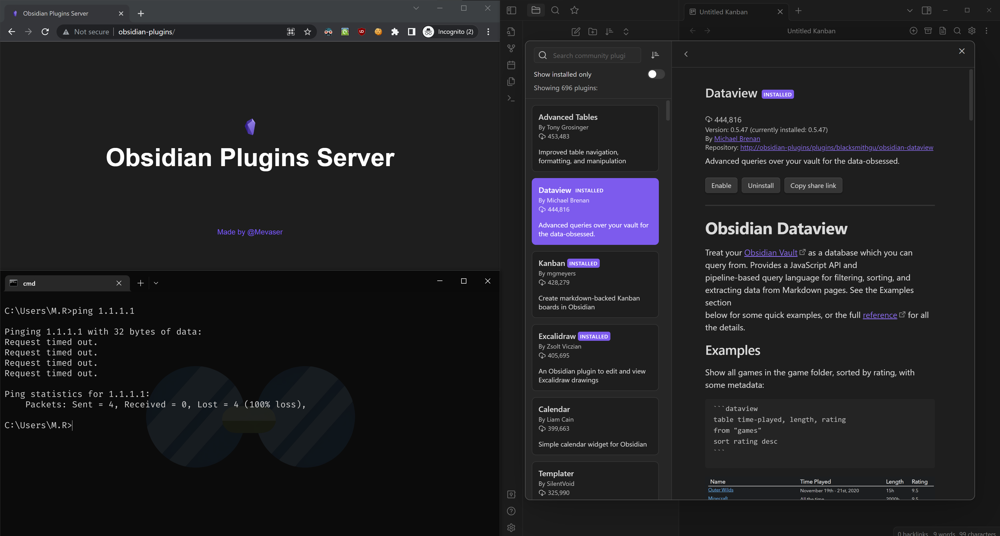

# About
Offline obsidian plugins server.

# Setup
- Run the [downloader](./downloader/main.go)
- Setup nginx with the [config](./nginx/nginx.conf), make sure the paths are correct.
- To patch clients to use the [patcher.py](./patcher/patcher.py) with the server address as an argument.

# Notes
- This probably breaks stuff in the obsidian app.
- Tested on the following obsidian versions: v1.0.3